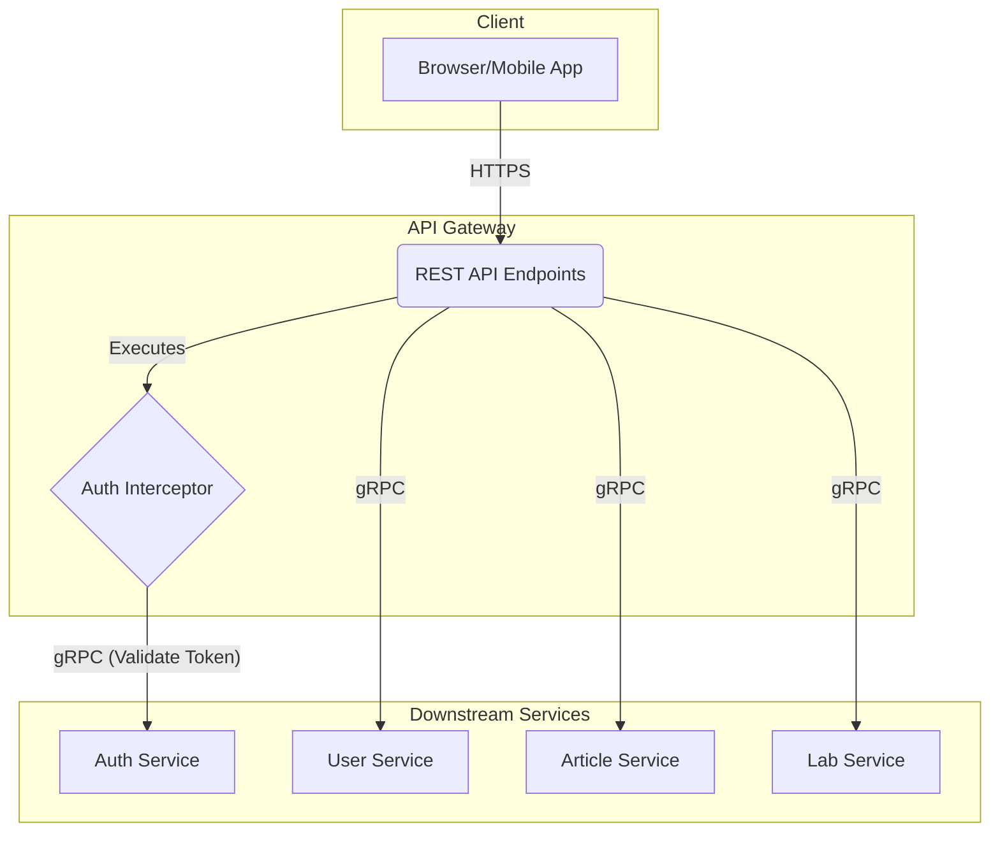

# Open Labs Share - API Gateway

The API Gateway is the central entry point for all client requests to the Open Labs Share platform. It provides a unified and secure REST API, routing requests to the appropriate downstream microservices while handling cross-cutting concerns like authentication and logging.

## Table of Contents
- [Core Responsibilities](#core-responsibilities)
- [Technology Stack](#technology-stack)
- [Getting Started](#getting-started)
- [API Documentation (Swagger)](#api-documentation-swagger)
- [Architecture & Service Connections](#architecture--service-connections)
- [Environment Configuration](#environment-configuration)
- [Deployment](#deployment)

## Core Responsibilities

- **Single Entry Point**: Acts as a "front door" for all incoming API requests from client applications.
- **Request Routing**: Intelligently routes requests to the correct downstream microservice (`auth`, `user`, `article`, `lab`).
- **Authentication & Security**: Integrates with the `auth-service` to secure endpoints, validating JWT tokens for every protected request.
- **Unified API**: Exposes a consistent RESTful API to the outside world, abstracting the underlying microservice architecture.
- **API Documentation**: Automatically generates and exposes interactive API documentation using Swagger/OpenAPI.

## Technology Stack

- **Java 21**: Core programming language.
- **Spring Boot 3**: Framework for building the application.
- **Spring Web**: For creating RESTful APIs.
- **Spring AOP**: Used for custom annotations like `@RequireAuth`.
- **gRPC**: For high-performance, internal communication with downstream microservices.
- **SpringDoc OpenAPI**: For generating Swagger UI documentation.
- **Lombok**: To reduce boilerplate code.
- **Gradle**: For dependency management and building the project.
- **Docker**: For containerizing the application.

## Getting Started

Follow these steps to run the API Gateway on your local machine.

### Prerequisites
- Java Development Kit (JDK) 21 or later.
- Gradle 8.5 or later.

### Running the Application

Check out the [**DEPLOY.md**](DEPLOY.md) file with all instructions.

**Note**: The service is configured with `wait-for-ready: true` for all gRPC clients. This means the API Gateway will start up successfully even if the downstream microservices are not yet running. It will wait for them to become available before forwarding requests.

## API Documentation (Swagger)

Once the application is running, you can access the interactive Swagger UI to explore and test the API endpoints.

- **Swagger UI URL**: [http://localhost:8080/swagger-ui.html](http://localhost:8080/swagger-ui.html)
- **OpenAPI Spec (JSON)**: [http://localhost:8080/api-docs](http://localhost:8080/api-docs)

## Architecture & Service Connections

The API Gateway is the orchestrator for client requests, communicating with various backend services via gRPC.

### Request Flow

1.  A **Client** sends a REST request to an endpoint on the API Gateway.
2.  The `AuthInterceptor` intercepts the request to check for the `@RequireAuth` annotation.
3.  If the endpoint is protected, the interceptor makes a gRPC call to the **Auth Service** to validate the provided JWT.
4.  If the token is valid, the request is forwarded to the appropriate controller (`UserController`, `ArticleController`, etc.).
5.  The controller calls its service layer, which then makes a gRPC call to the corresponding downstream microservice (**User Service**, **Article Service**, or **Lab Service**) to fulfill the request.
6.  The response is propagated back through the API Gateway to the client.

## Environment Configuration

The service can be configured using environment variables, which are imported from a `.env` file located in the root directory of the service.

1.  Create a `.env` file. You can copy the structure from the gRPC service configurations.
2.  Set the following variables as needed:

| Variable                | Description                                        | Default       |
| ----------------------- | -------------------------------------------------- | ------------- |
| `SPRING_APP_PORT`       | The port on which the API Gateway will run.        | `8080`        |
| `AUTH_SERVICE_HOST`     | Hostname for the Authentication gRPC service.      | `localhost`   |
| `AUTH_SERVICE_PORT`     | Port for the Authentication gRPC service.          | `9090`        |
| `USER_SERVICE_HOST`     | Hostname for the User gRPC service.                | `localhost`   |
| `USER_SERVICE_PORT`     | Port for the User gRPC service.                    | `9091`        |
| `ARTICLE_SERVICE_HOST`  | Hostname for the Article gRPC service.             | `localhost`   |
| `ARTICLE_SERVICE_PORT`  | Port for the Article gRPC service.                 | `9092`        |
| `LAB_SERVICE_HOST`      | Hostname for the Lab gRPC service.                 | `localhost`   |
| `LAB_SERVICE_PORT`      | Port for the Lab gRPC service.                     | `9093`        |
| `FEEDBACK_SERVICE_HOST` | Hostname for the Feedback gRPC service.            | `localhost`   |
| `FEEDBACK_SERVICE_PORT` | Port for the Feedback gRPC service.                | `9094`        |
| `GRPC_NEGOTIATION_TYPE` | gRPC negotiation type (e.g., `plaintext` or `tls`).| `plaintext`   |

## Deployment

For detailed instructions on how to build a Docker image and deploy this service, please refer to the [**DEPLOY.md**](DEPLOY.md) file. 