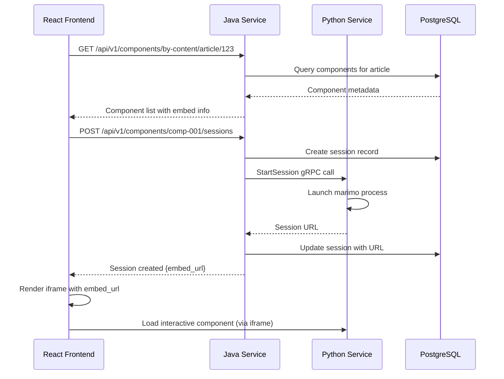

## 1. 🔄 **Session in Terms of Marimo**

A **Marimo session** represents a **running instance** of a Marimo notebook with its own execution environment and state.

### What it means:
- **Process Instance**: Each session is a separate Python process running `marimo run` or `marimo edit`
- **State Management**: The session maintains the current values of all interactive components (sliders, inputs, etc.)
- **Execution Context**: Variables, imports, and computed results are isolated per session
- **User Isolation**: Different users get separate sessions to avoid conflicts

### In our architecture:
```python
# Python service starts a session like this:
import marimo
import subprocess

def start_session(component_id: str, session_id: str):
    # Launch marimo process for this specific component
    process = subprocess.Popen([
        "marimo", "run", f"notebooks/{component_id}.py", 
        "--host", "0.0.0.0", 
        "--port", f"{5001 + hash(session_id) % 1000}"
    ])
    
    return {
        "session_url": f"http://python-service:5001/component/{session_id}",
        "process_id": process.pid
    }
```

### Database representation:
```sql
-- component_sessions table tracks these running instances
INSERT INTO component_sessions (
    id, component_id, session_token, python_process_id, status
) VALUES (
    'sess-123', 'comp-001', 'token-abc', '12345', 'active'
);
```

---

## 2. 🖼️ **Embedding in Terms of Marimo**

**Marimo embedding** allows you to **integrate interactive Marimo components** into external web applications (like our React frontend).

### Three embedding modes:

#### **A) iFrame Embedding** (Primary approach)
```html
<!-- Frontend embeds Marimo component -->
<iframe 
    src="http://python-service:5000/embed/comp-001/sess-123"
    width="800" 
    height="600"
    sandbox="allow-scripts allow-same-origin">
</iframe>
```

#### **B) WebAssembly Embedding** (Static components)
```python
# Marimo can compile to WASM for static components
import marimo as mo

# This gets compiled to WASM and embedded directly
@mo.ui.component
def static_plot():
    return mo.ui.plotly(static_data_viz)
```

#### **C) Component-level Embedding** (Individual widgets)
```javascript
// Embed just a single component (like a slider)
<MarimoSlider 
    componentId="comp-001" 
    sessionId="sess-123"
    parameterName="learning_rate"
    onValueChange={handleValueChange}
/>
```

---

## 3. 🌐 **Frontend Integration with Marimo Service Architecture**

Here's how our React frontend will work with the two-service Marimo architecture:

### **Workflow:**



### **Frontend Implementation Example:**

```tsx
// React component for embedding Marimo
import React, { useState, useEffect } from 'react';

interface MarimoComponentProps {
  componentId: string;
  articleId: string;
}

export const MarimoComponent: React.FC<MarimoComponentProps> = ({ 
  componentId, 
  articleId 
}) => {
  const [sessionUrl, setSessionUrl] = useState<string>('');
  const [loading, setLoading] = useState(true);

  useEffect(() => {
    // Create session via Java service
    const createSession = async () => {
      try {
        const response = await fetch(
          `/api/v1/components/${componentId}/sessions`, 
          { method: 'POST' }
        );
        const data = await response.json();
        setSessionUrl(data.session_url);
        setLoading(false);
      } catch (error) {
        console.error('Failed to create Marimo session:', error);
      }
    };

    createSession();
  }, [componentId]);

  if (loading) return <div>Loading interactive component...</div>;

  return (
    <div className="marimo-container">
      <iframe
        src={sessionUrl}
        width="100%"
        height="600"
        frameBorder="0"
        sandbox="allow-scripts allow-same-origin allow-forms"
        title={`Interactive Component ${componentId}`}
      />
    </div>
  );
};

// Usage in article/lab page
<MarimoComponent 
  componentId="comp-001" 
  articleId="art-123" 
/>
```

---

## 4. 📁 **Component Assets in Terms of Marimo**

**Component assets** are **files and resources** that Marimo components need to function properly.

### **Types of assets:**

#### **A) Data Files**
```python
# notebook.py references data files
import pandas as pd
import marimo as mo

# Asset: sample_dataset.csv
df = pd.read_csv('data/sample_dataset.csv')
plot = mo.ui.plotly(px.scatter(df, x='x', y='y'))
```

#### **B) Configuration Files**
```json
// Asset: plot_config.json
{
  "theme": "plotly_dark",
  "default_layout": {
    "width": 800,
    "height": 400
  },
  "color_palette": ["#1f77b4", "#ff7f0e", "#2ca02c"]
}
```

#### **C) Image Assets**
```python
# Asset: algorithm_diagram.png
import marimo as mo

mo.md(f"""
## Algorithm Visualization
})
""")
```

#### **D) Notebook Files**
```python
# Asset: notebook.py (the Marimo notebook itself)
import marimo as mo

# Interactive component definition
slider = mo.ui.slider(0, 100, value=50)
mo.md(f"Value: {slider.value}")
```

### **Asset Management in our architecture:**
```sql
-- Assets stored in database with MinIO paths
INSERT INTO component_assets (
    component_id, asset_type, file_path, mime_type
) VALUES (
    'comp-001', 'data', 'marimo/comp-001/data/dataset.csv', 'text/csv'
),
(
    'comp-001', 'config', 'marimo/comp-001/config/settings.json', 'application/json'
),
(
    'comp-001', 'notebook', 'marimo/comp-001/notebook.py', 'text/x-python'
);
```

---

## 5. 🗄️ **Why MinIO is Needed**

**MinIO object storage** is essential for our Marimo service architecture for several reasons:

### **A) File Storage & Organization**
```
MinIO Structure:
marimo/
├── components/
│   ├── comp-001/
│   │   ├── notebook.py          # Marimo notebook file
│   │   ├── data/
│   │   │   └── dataset.csv      # Component data
│   │   ├── assets/
│   │   │   └── images/          # Static assets
│   │   └── config/
│   │       └── settings.json    # Component config
│   └── comp-002/
│       └── ...
└── shared/
    ├── libraries/               # Shared Python modules
    └── templates/              # Component templates
```

### **B) Scalability & Performance**
- **Distributed Access**: Both Java and Python services can access files
- **CDN Integration**: MinIO can serve static assets directly to frontend
- **Versioning**: Track changes to notebook files and data
- **Caching**: MinIO provides built-in caching for frequently accessed files

### **C) Security & Access Control**
```java
// Java service controls access to MinIO
@Service
public class MarimoFileService {
    
    public String getPresignedUrl(String componentId, String assetPath) {
        // Generate temporary access URL for component assets
        return minioClient.getPresignedObjectUrl(
            GetPresignedObjectUrlArgs.builder()
                .bucket("marimo")
                .object("components/" + componentId + "/" + assetPath)
                .expiry(3600) // 1 hour access
                .build()
        );
    }
}
```

### **D) Component Isolation**
- **Namespace Separation**: Each component gets its own folder structure
- **Data Protection**: Components can't access each other's data
- **Version Management**: Easy to backup/restore component versions

### **E) Integration with Marimo**
```python
# Python service serves files to Marimo processes
def setup_component_environment(component_id: str):
    # Download component files from MinIO to local temp directory
    minio_client.fget_object(
        "marimo", 
        f"components/{component_id}/notebook.py",
        f"/tmp/marimo/{component_id}/notebook.py"
    )
    
    # Set up data directory
    for asset in get_component_assets(component_id):
        minio_client.fget_object(
            "marimo",
            asset.file_path,
            f"/tmp/marimo/{component_id}/{asset.local_path}"
        )
```