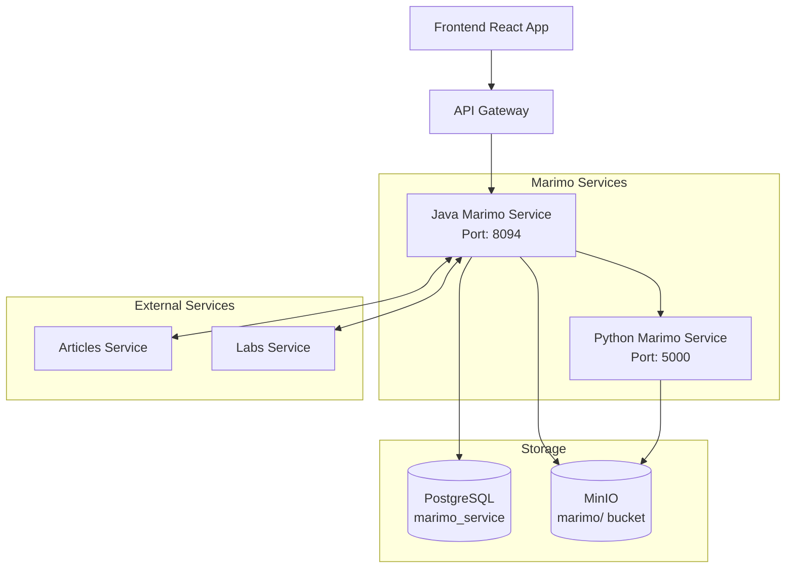
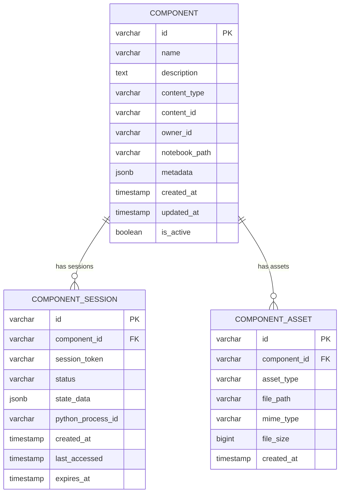
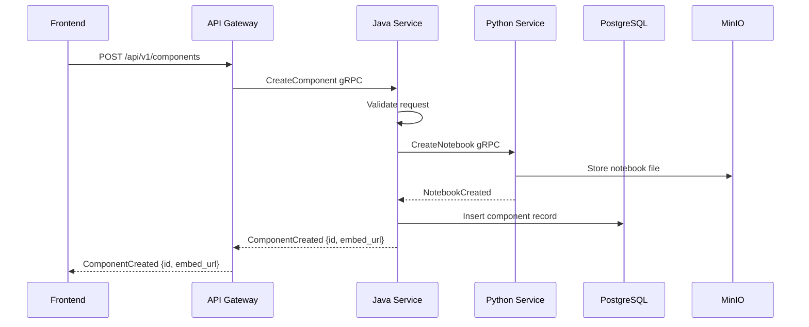
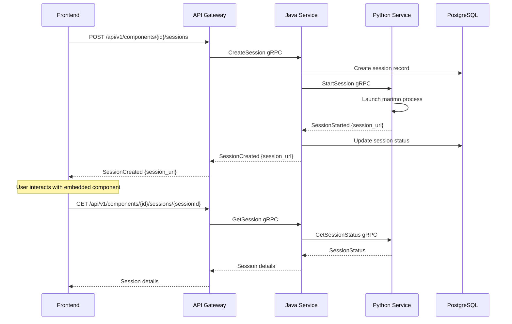
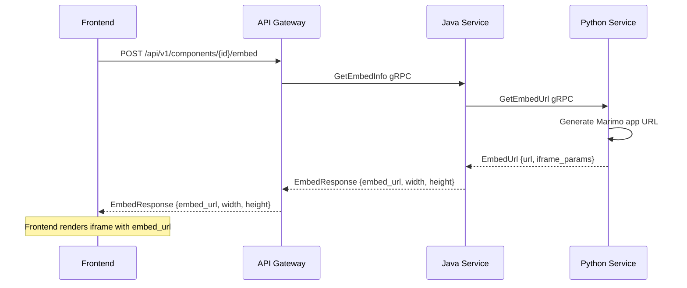

# Marimo Interactive Components Service - Simplified Architecture

## Overview

The Marimo service provides interactive notebook capabilities for labs and articles through a two-service architecture:

- **Java Service**: Business logic, data management, and integration with other services
- **Python Service**: Direct Marimo execution, notebook management, and interactive component serving


## Architecture

### High-Level Service Interaction



### Service Responsibilities

#### Java Marimo Service (Port: 8094)

- **REST API**: Provides endpoints for frontend integration
- **Business Logic**: Component lifecycle, permissions, validation
- **Data Management**: PostgreSQL operations, metadata management
- **Service Integration**: Communication with articles-service and labs-service
- **File Management**: MinIO operations for notebook files
- **Security**: Authentication, authorization, input validation

#### Python Marimo Service (Port: 5000)

- **Marimo Execution**: Direct notebook execution using Marimo APIs
- **Component Serving**: Serves interactive Marimo components as web apps
- **Notebook Management**: Create, update, delete Marimo notebook files
- **Live Sessions**: Manages active notebook sessions and state
- **WebAssembly**: Embedding support for static components

## Database Schema

### Simplified Entity Model



### Database Tables

#### `components`

```sql
-- PostgreSQL-compatible table definition
CREATE TABLE components (
    id VARCHAR(255) PRIMARY KEY,
    name VARCHAR(255) NOT NULL,
    description TEXT,
    content_type VARCHAR(50) NOT NULL CHECK (content_type IN ('article', 'lab')),
    content_id VARCHAR(255) NOT NULL,
    owner_id VARCHAR(255) NOT NULL,
    notebook_path VARCHAR(500) NOT NULL,
    metadata JSONB DEFAULT '{}',
    created_at TIMESTAMP DEFAULT CURRENT_TIMESTAMP,
    updated_at TIMESTAMP DEFAULT CURRENT_TIMESTAMP,
    is_active BOOLEAN DEFAULT true,
    
    UNIQUE(content_type, content_id, name)
);

-- Indexes created separately for PostgreSQL compatibility
CREATE INDEX idx_content ON components(content_type, content_id);
CREATE INDEX idx_owner ON components(owner_id);
CREATE INDEX idx_active ON components(is_active);
```

#### `component_sessions`

```sql
-- PostgreSQL-compatible table definition
CREATE TABLE component_sessions (
    id VARCHAR(255) PRIMARY KEY,
    component_id VARCHAR(255) NOT NULL,
    session_token VARCHAR(500) NOT NULL UNIQUE,
    status VARCHAR(20) DEFAULT 'active' CHECK (status IN ('active', 'idle', 'expired')),
    state_data JSONB DEFAULT '{}',
    python_process_id VARCHAR(100),
    created_at TIMESTAMP DEFAULT CURRENT_TIMESTAMP,
    last_accessed TIMESTAMP DEFAULT CURRENT_TIMESTAMP,
    expires_at TIMESTAMP,
    
    FOREIGN KEY (component_id) REFERENCES components(id) ON DELETE CASCADE
);

-- Indexes created separately for PostgreSQL compatibility
CREATE INDEX idx_session_token ON component_sessions(session_token);
CREATE INDEX idx_component ON component_sessions(component_id);
CREATE INDEX idx_status ON component_sessions(status);
CREATE INDEX idx_expires ON component_sessions(expires_at);

-- Trigger for automatically updating last_accessed timestamp
CREATE OR REPLACE FUNCTION update_last_accessed() RETURNS TRIGGER AS $$
BEGIN
    NEW.last_accessed = CURRENT_TIMESTAMP;
    RETURN NEW;
END;
$$ LANGUAGE plpgsql;

CREATE TRIGGER update_sessions_last_accessed
    BEFORE UPDATE ON component_sessions
    FOR EACH ROW
    EXECUTE FUNCTION update_last_accessed();
```

#### `component_assets`

```sql
-- PostgreSQL-compatible table definition
CREATE TABLE component_assets (
    id VARCHAR(255) PRIMARY KEY,
    component_id VARCHAR(255) NOT NULL,
    asset_type VARCHAR(50) NOT NULL CHECK (asset_type IN ('data', 'image', 'notebook', 'config')),
    file_path VARCHAR(500) NOT NULL,
    mime_type VARCHAR(100),
    file_size BIGINT,
    created_at TIMESTAMP DEFAULT CURRENT_TIMESTAMP,
    
    FOREIGN KEY (component_id) REFERENCES components(id) ON DELETE CASCADE
);

-- Indexes created separately for PostgreSQL compatibility
CREATE INDEX idx_component ON component_assets(component_id);
CREATE INDEX idx_asset_type ON component_assets(asset_type);
```

## Technology Stack

### Java Service

- **Framework**: Spring Boot 3.5.0
- **Language**: Java 21
- **Database**: Spring Data JPA with PostgreSQL
- **Storage**: MinIO Java SDK
- **Communication**: gRPC server (API Gateway) + gRPC client (Python service)
- **Dependencies**: 
  - spring-boot-starter-data-jpa
  - postgresql
  - minio
  - grpc-spring-boot-starter
  - spring-boot-starter-actuator

### Python Service

- **Framework**: FastAPI
- **Language**: Python 3.11+
- **Notebook Engine**: Marimo
- **Communication**: gRPC server
- **Process Management**: multiprocessing, subprocess
- **Dependencies**:
  - fastapi
  - marimo
  - grpcio
  - minio
  - uvicorn

## API Design

### Java Service gRPC Interface (exposed to API Gateway)

```protobuf
service MarimoService {
    // Component Management
    rpc ListComponents(ListComponentsRequest) returns (ListComponentsResponse);
    rpc CreateComponent(CreateComponentRequest) returns (CreateComponentResponse);
    rpc GetComponent(GetComponentRequest) returns (GetComponentResponse);
    rpc UpdateComponent(UpdateComponentRequest) returns (UpdateComponentResponse);
    rpc DeleteComponent(DeleteComponentRequest) returns (DeleteComponentResponse);
    
    // Session Management
    rpc CreateSession(CreateSessionRequest) returns (CreateSessionResponse);
    rpc GetSession(GetSessionRequest) returns (GetSessionResponse);
    rpc CloseSession(CloseSessionRequest) returns (CloseSessionResponse);
    
    // Component Integration
    rpc GetComponentsByContent(GetComponentsByContentRequest) returns (GetComponentsByContentResponse);
    rpc GetEmbedInfo(GetEmbedInfoRequest) returns (GetEmbedInfoResponse);
    
    // Asset Management
    rpc ListAssets(ListAssetsRequest) returns (ListAssetsResponse);
    rpc UploadAsset(UploadAssetRequest) returns (UploadAssetResponse);
    rpc DeleteAsset(DeleteAssetRequest) returns (DeleteAssetResponse);
}
```

### Python Service gRPC Interface

```protobuf
service MarimoExecutionService {
    rpc CreateNotebook(CreateNotebookRequest) returns (CreateNotebookResponse);
    rpc UpdateNotebook(UpdateNotebookRequest) returns (UpdateNotebookResponse);
    rpc DeleteNotebook(DeleteNotebookRequest) returns (DeleteNotebookResponse);
    
    rpc StartSession(StartSessionRequest) returns (StartSessionResponse);
    rpc GetSessionStatus(GetSessionStatusRequest) returns (GetSessionStatusResponse);
    rpc StopSession(StopSessionRequest) returns (StopSessionResponse);
    
    rpc GetEmbedUrl(GetEmbedUrlRequest) returns (GetEmbedUrlResponse);
    rpc GetNotebookContent(GetNotebookContentRequest) returns (GetNotebookContentResponse);
}
```

## Component Workflows

### 1. Component Creation Flow



### 2. Component Execution Flow



### 3. Component Embedding Flow



## Use Cases

### Interactive Data Visualization

```python
# Marimo notebook: data_viz.py
import marimo as mo
import plotly.express as px
import pandas as pd

# Load data from lab submission
data = load_lab_data()

# Interactive controls
date_range = mo.ui.date_range()
metric_selector = mo.ui.dropdown(["accuracy", "loss", "f1_score"])

# Reactive plot
filtered_data = data[
    (data.date >= date_range.value[0]) & 
    (data.date <= date_range.value[1])
]

fig = px.line(filtered_data, x="date", y=metric_selector.value)
mo.ui.plotly(fig)
```

### Real-time Lab Feedback

```python
# Marimo notebook: lab_feedback.py
import marimo as mo

# Student code input
code_input = mo.ui.code_editor(language="python")
run_button = mo.ui.button("Run Code")

# When button clicked, execute and show results
if run_button.value:
    try:
        result = execute_student_code(code_input.value)
        mo.md(f"✅ **Success**: {result}")
    except Exception as e:
        mo.md(f"❌ **Error**: {str(e)}")
```

### Article Interactive Examples

```python
# Marimo notebook: algorithm_demo.py
import marimo as mo
import numpy as np

# Interactive algorithm parameters
algorithm = mo.ui.dropdown(["bubble_sort", "quick_sort", "merge_sort"])
array_size = mo.ui.slider(10, 100, value=20)
speed = mo.ui.slider(0.1, 2.0, value=1.0)

# Generate random array
arr = np.random.randint(1, 100, array_size.value)

# Visualize sorting algorithm
if algorithm.value == "bubble_sort":
    visualize_bubble_sort(arr, speed.value)
elif algorithm.value == "quick_sort":
    visualize_quick_sort(arr, speed.value)
# etc...
```
