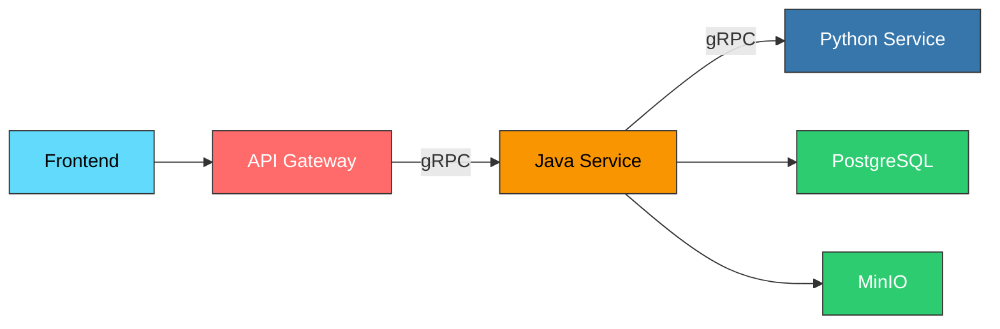

# Marimo Service - Interactive Components for Labs & Articles

## What is Marimo?

**Marimo** is a reactive notebook framework for Python that enables creation of interactive web applications with components like sliders, plots, inputs, and visualizations.

## Purpose in OpenLabsShare

The **Marimo Service** embeds **interactive components** within labs and articles, allowing students to:

- Manipulate parameters with sliders and inputs
- See real-time plot updates and calculations  
- Experiment with code without leaving the learning content
- Interact with scientific simulations and data visualizations

## Architecture Overview



## Integration Points

### For Frontend Developers:

- Components are embedded as iframes with unique session URLs
- API Gateway exposes REST endpoints that route to Java service via gRPC (e.g. `POST /api/v1/components/{id}/sessions` to create sessions)
- All communication flows through API Gateway (no direct service calls)

### For Backend Developers:

- Java service exposes gRPC interface to API Gateway
- Components stored as Python notebooks in MinIO storage
- Session data managed in PostgreSQL (`component_sessions` table)
- gRPC communication: API Gateway ↔ Java Service ↔ Python Service

### For Content Authors:

- Write standard Python code using Marimo syntax
- Upload `.py` notebook files through component management API
- Support for common scientific libraries (numpy, pandas, matplotlib, plotly)

## Quick Example

```python
import marimo as mo
import numpy as np
import matplotlib.pyplot as plt

# Interactive slider
x_range = mo.ui.slider(1, 10, value=5, label="X Range")

# Reactive plot that updates when slider changes
if x_range.value:
    x = np.linspace(0, x_range.value, 100)
    y = np.sin(x)
    plt.plot(x, y)
    plt.title(f"Sine Wave (0 to {x_range.value})")
```

---

For detailed technical documentation, see `MARIMO_README.md` and `DATABASE_SCHEMA.md`. 